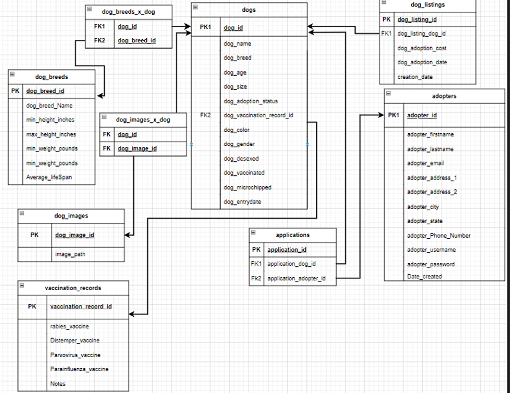

# 🐾 SQL Database Project

A fully normalized relational database designed to support efficient dog-to-adopter matching, centralized operations, and actionable reporting. This solo project spans schema architecture, data modeling, and BI integration using SQL Server and Tableau.

## 📌 Project Highlights

- **Built from scratch** using SQL: table creation, foreign keys, inserts, data validation
- **Normalized structure** with support for many-to-many relationships
- **Entity-relationship and logical data modeling**
- **Business-focused requirements** including adoption status tracking, vaccination records, and breed metadata
- **SQL queries** for analysis and validation

## 🧠 Skills Demonstrated

- SQL (DDL & DML)
- Relational database design
- Normalization and referential integrity
- ERD and schema documentation
- Practical application of data privacy and system design concepts

## 📂 Key Tables

- `dog`, `adopter`, `applications`, `vaccination_record`
- `dog_listing`, `dog_breed`, `dog_image`
- Relationship tables: `dog_breed_x_dog`, `dog_image_x_dog`

## 📊 ER Diagram

## 💾 SQL Script

Full implementation:
[`SQL_DB_Script.sql`](SQL_DB_Script.sql)

## 🔐 Design Considerations

- Designed with **data accuracy, privacy, and system performance** in mind
- Risk planning included for third-party integration and legal compliance

## 👥 Project Context

Developed as a group project. My key contributions included:
- Data modeling
- SQL table creation and data validation
- Drafting documentation and business logic

---

